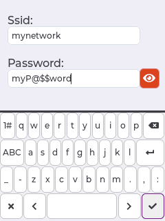

At first boot, when no wifi setup is found, the device will create an initial Access Point for configuring the device.
If the touchscreen is properly connected it will display a QR code, along with a temporary SSID and password, to connect to the device.

<figure class="third">
    <a href="assets//images/hasp/oobe_setup.png"></a>
    <a href="assets//images/hasp/touch_calibration.png"></a>
    <a href="assets//images/hasp/wifi_setup.png"></a>
</figure>

Either use the touchscreen interface or connect via a webbrowser to setup the credentials for your local wifi access point:

## Using Touchscreen

1. Tap on the screen to start a Touch Calibration sequence:
2. Precisely touch the 4 courners as indicated
3. Use the on-screen keyboard to enter your local SSID and password
  - Tap on the Checkmark button in the lower righthand corner to save the settings

The device will validate the entered credentials and reboot if they are correct.

## Using WiFi Access-Point

Connect to the temporary Access Point by scanning the QR on the display, if available.
Or Check the serial log for the SSID and password to connect.

- Browse to http://192.168.4.1
- Enter your local SSID and password for joining the device to your wireless network
- Click Save Settings
- The device will automatically reboot and connect to your wireless LAN

## Using Command line

You can also directly configure the wifi settings via the serial console:

```bash
ssid myAccessPointName
pass myWifiPassword
reboot
```

> [!TIP]
> To skip this step, wifi credentials can be saved into the .bin file when you compile the firmware yourself.

