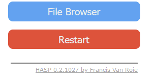
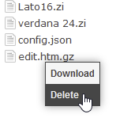

#### :question: The font looks tiny

On ESP8266, the out-of-the box font is Unscii 8pt because this font takes up very little space in memory and on flash.
This default font is just intended to get the device setup, then you can Upload your own .zi font.

On ESP32, the default font is Monserrat 12.

#### :question: How to use Fontawesome icons?

Upload another .zi file named fontawesome*xx*.zi of the same point size as the normal text .zi font.
e.g. If your custom font is `arial24.zi´, you should also add a `fontawesome24.zi` file.

#### :question: Is there a file browser built-in?

*A:* There is no native file browser included yet, as this currently is low on the priority list.

However, you can upload the `edit.htm.gz` (3kB) file to the SPIFFS partition from the ESP32 FSBrowser repository.
Download it from: https://github.com/espressif/arduino-esp32/blob/master/libraries/WebServer/examples/FSBrowser/data/edit.htm.gz

When the `edit.htm.gz` file is present on Spiffs you will see an additional File Browser button on the Main Webpage:

Using that webpage, you can right-click and delete files:

#### :question: How to delete files from flash?

*See: Is there a file browser built-in?*