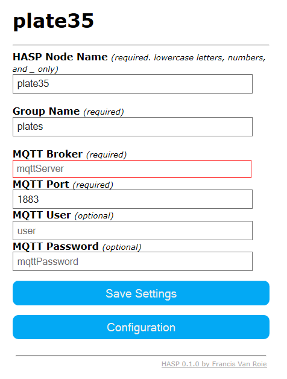

All communication between **HASP Open Display** and your Home Automation service is done over MQTT. You will need an already working MQTT Broker.

:question: If you do not know what MQTT is you can find more about the protocol on [MQTT Essentials](http://www.hivemq.com/mqtt-essentials/)




### MQTT Settings

##### HASP Node Name
The *Node Name* is the unique identifier of your device on your MQTT Broker.

For example, setting the *Node Name* to **plate35** will make the device listen and communicate on the main topic **hasp/plate35/**

##### Group Name
The *Group Name* is the unique identifier for a **Group** of devices.

For example, the default *Group Name* is **plates**. This will make all devices in this group listen on the main topic **hasp/plates/**
This way you can send a command to all devices in the group at the same moment. Each devices will only respond on their own main *Node Name* topic.

##### MQTT Broker
Set the IP or hostname of your MQTT Broker

##### MQTT Port
Set the port for your MQTT Broker

##### MQTT User and Password
Enter credentials if your *MQTT Broker* requires a Username and Password.

---

Click 'Save Settings' to save you settings to the device. A restart is required to make the settings active. Navigate back to the Main Menu and click Restart to activate the settings.


## Commandline

You can also configure the mqtt settings via the serial or telnet console:

```bash
hostname myPlateName
mqtthost 192.168.0.123
mqttport 1883
mqttuser myUsername
mqttpass myPassword
reboot
```