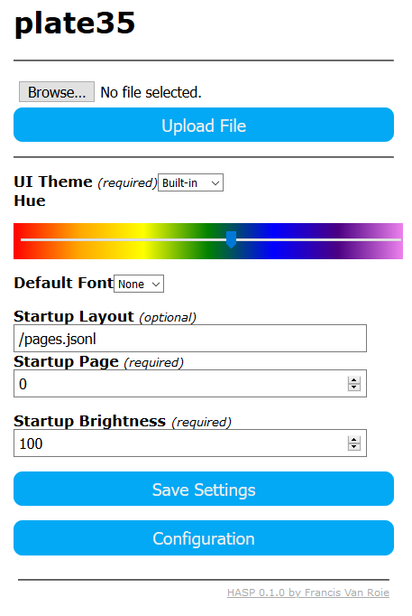

You can configure the general look and feel for the interface by uploading you favorite fonts and selecting your favorite theme and color.

### HASP Settings

##### Upload

With the upload function you can upload 2 types of files
 * .jsonl
    This file contains the layout for the pages
    See 'pages' section for more information on this file
 * .zi
    These are font files used in the Nextion/TJC HMI disp.

##### UI Theme and Hue

Select one of the built-in themes to select the general style for the HASP interface.
With the Hue slider you can select the base color for the built-in theme.

##### Startup layout

Enter the filename of the .jsonl you have uploaded to enables the layout on startup.

##### Startup Page

Select to what page the display should switch on startup.

##### Startup brightness

Select the brightness level of the display on startup.
*Please note that the display must support dim feature and GPIO for dim is set in display setup.*

---

Click 'Save Settings' to save you settings to the device. A restart is required to make the settings active. Navigate back to the Main Menu and click Restart to activate the settings.

