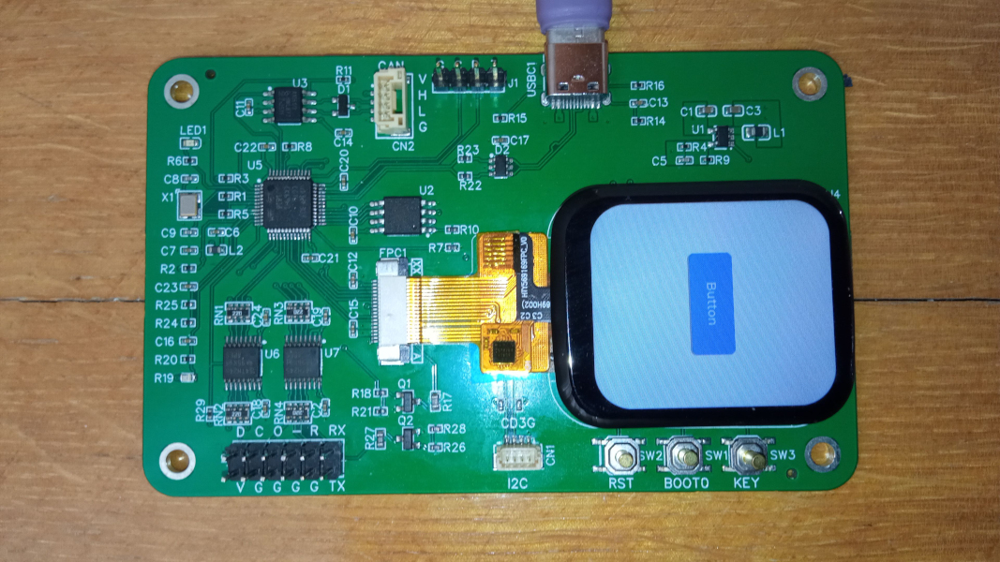

# cst816t capacitive touch ic

[](https://github.com/koendv/cst816t/raw/master/extras/P169H002-CTP.jpg)


This is an Arduino library for the cst816t capacitive touch ic.  The cst816t capacitive touch ic is able to decode clicks, double clicks, swipes and long press in hardware. Tested on stm32duino.

The cst816t runs on voltages from 1.8V to 3.3V.  Do not connect the cst816t to 5V arduinos  such as Arduino UNO. Connecting the cst816t to 5V will probably damage the device.

Hardware requirements:

- power supply 2.8V to 3.6V
- power supply ripple <= 50mv;
- logic level 1.8V to 3.3V
- i2c rate 10Khz to 400Khz

## Use

Code for the cst816t consists of a setup, done once, and a loop, done repeatedly.

## Setup

The cst816t touch sensor needs an I2C bus, a reset pin  and a interrupt pin:
```
#include <Wire.h>
#include "cst816t.h"
TwoWire Wire2(TP_SDA, TP_SCL);
cst816t touchpad(Wire2, TP_RST, TP_IRQ);
```
The ic can run in four modes: touch, change, fast, motion.

### mode touch
```
void setup() {
  touchpad.begin(mode_touch);
}
```
In mode _touch_, if a finger touches the display the ic sends an interrupt every 10ms. After receiving the interrupt, you can read updated touch coordinates and finger count. All processing is done on the mcu.

### mode change
```
void setup() {
  touchpad.begin(mode_change);
}
```
In mode _change_ the ic sends an interrupt when the finger changes position. Compared to mode touch, the number of interrupts is more moderate.

### mode fast

```
void setup() {
  touchpad.begin(mode_fast);
}
```

In mode _fast_ the ic sends an interrupt when the finger has completed one of the following movements: single click, swipe up, swipe down, swipe left, swipe right.

Touch response is fast because there is no need to wait to distinguish between single click, double click and long press.

### mode motion

```
void setup() {
  touchpad.begin(mode_motion);
}
```

In mode _motion_ the ic sends an interrupt when the finger has completed the following movements: single click, **double click**, swipe up, swipe down, swipe left, swipe right, **long press**. All processing is done in the cst816 touch ic. The processing in the mcu is minimal.

## Loop

Test repeatedly if there is an update from the touch panel. If there is an update from the touch panel, read gesture, (x, y) coordinates, and number of fingers touching the display.

```
void loop() {
  if (touchpad.available()) {
    switch (touchpad.gesture_id) {
      case GESTURE_NONE:
        Serial.print("NONE");
        break;
      case GESTURE_SWIPE_DOWN:
        Serial.print("SWIPE DOWN");
        break;
      case GESTURE_SWIPE_UP:
        Serial.print("SWIPE UP");
        break;
      case GESTURE_SWIPE_LEFT:
        Serial.print("SWIPE LEFT");
        break;
      case GESTURE_SWIPE_RIGHT:
        Serial.print("SWIPE RIGHT");
        break;
      case GESTURE_SINGLE_CLICK:
        Serial.print("SINGLE CLICK");
        break;
      case GESTURE_DOUBLE_CLICK:
        Serial.print("DOUBLE CLICK");
        break;
      case GESTURE_LONG_PRESS:
        Serial.print("LONG PRESS");
        break;
      default:
        Serial.print("UNKNOWN ");
        break;
    }
    Serial.print("at (");
    Serial.print(touchpad.x);
    Serial.print(", ");
    Serial.print(touchpad.y);
    Serial.print(") fingers: ");
    Serial.println(touchpad.finger_num);
  }
}
```

## Examples

The library comes with three example Arduino sketches: touchme, smartwatch, and lvgl. To compile the examples, use [stm32duino](https://github.com/stm32duino/Arduino_Core_STM32/wiki).

### touchme

A simple sketch that uses the CST816T touch sensor. When the display is touched, the (x, y) coordinates and the action - click or swipe - are printed on the serial port.

### smartwatch

A small Arduino sketch for the [P169H002-CTP](https://www.google.com/search?q=P169H002-CTP) smartwatch display. The P169H002-CTP is a 1.69 inch 240x280 lcd display with an ST7789 lcd driver and a CST816T touch sensor. The sketch prints a text - "click" or "swipe" - on the spot where the display is touched.

### lvgl

[LVGL](http://www.lvgl.io) (Light and Versatile Graphics Library) is a graphics library for embedded systems. An Arduino sketch is given which draws a button on a P169H002-CTP display.

This lvgl example uses the Adafruit GFX library. For improved speed, you may wish to check if there is a library that is more optimized for the processor you use.

## Links
Arduino libraries for ST7789 tft driver:

- [Adafruit ST7789](https://github.com/adafruit/Adafruit-ST7735-Library/)
- [TFT_eSPI](https://github.com/Bodmer/TFT_eSPI)
- [ST7789-STM32](https://github.com/Floyd-Fish/ST7789-STM32)
- [ST7789-STM32-uGUI](https://github.com/deividAlfa/ST7789-STM32-uGUI)

[Schematic](extras/Schematic_drawing_2023-06-21.pdf
) for the P169H002-CTP display. VCC = 3.3V. The ambient light sensor is used to set display intensity.

The P169H002-CTP display is available from [Aliexpress](https://www.aliexpress.com/item/1005005238299349.html).
